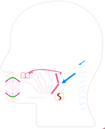

# speech-face

[Try it!](http://ajc5.github.io/speech-face)

Speech Face lets you generate sounds by controlling a virtual mouth. Use the virtual mouth like a musical instrument with speech organs as its controls (ie, mouth, tongue, vocal cords and breath).  Speech Face is a visualization of the [IPA](https://en.wikipedia.org/wiki/International_Phonetic_Alphabet) (International Phonetic Alphabet). An alphabet has also been created from the speech positions so that people can share pronunciations based on actual speech symbols.

Uses:
- pronounce language sounds by viewing speech organ positions rather than guessing from transliterations
- learn language sounds without the additional burden of memorizing abstract scripts. Makes it easier for kids to learn language.
- learn how to pronounce words by knowing which speech organs to control. Helps deaf and speech impaired people learn language sounds without guessing from mouth shapes.
- learn unfamiliar language scripts quickly by mapping them to their visual vocalizations. Helps voice actors and customer service representatives quickly learn accents and dialects of a language.
- pronounce new words correctly in non-phonetic languages like English. Helps native speakers learn new words without making assumptions.
- pronounce words without confusion when languages share the same script but have different pronunciations, eg, the letter A in Dutch and English. Helps language learners avoid inadvertently using their pronunciation rules for pronuncing foreigin words.
